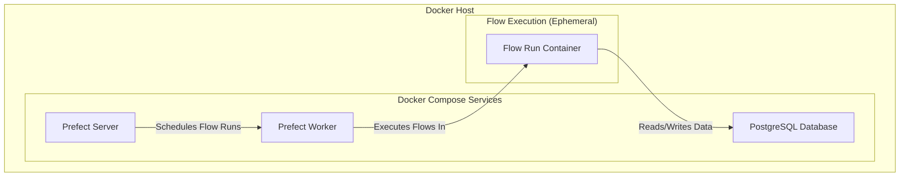

# Architecture Overview

This document provides a high-level overview of the `momentum-analysis-ingestion` service architecture.

## Components

The service is composed of three main components, all running as Docker containers managed by Docker Compose:

1.  **Prefect Server:** The central hub for orchestrating and monitoring the data ingestion pipelines. It provides a UI for observing flow runs and their states.

2.  **Prefect Worker:** This component is responsible for executing the data ingestion flows. It polls the Prefect server for new flow runs and, upon receiving a work order, it spins up a new Docker container to execute the flow.

3.  **PostgreSQL Database:** A PostgreSQL database is used to store all the financial data ingested by the Prefect flows.

## Mermaid Diagram

The following diagram illustrates the interaction between the different components of the system:

