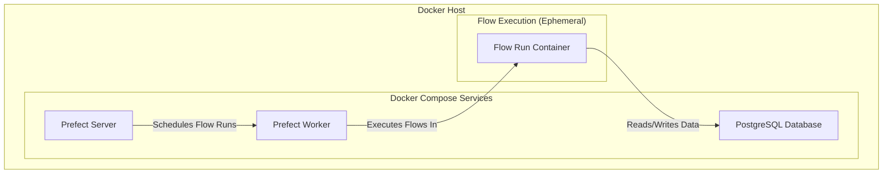
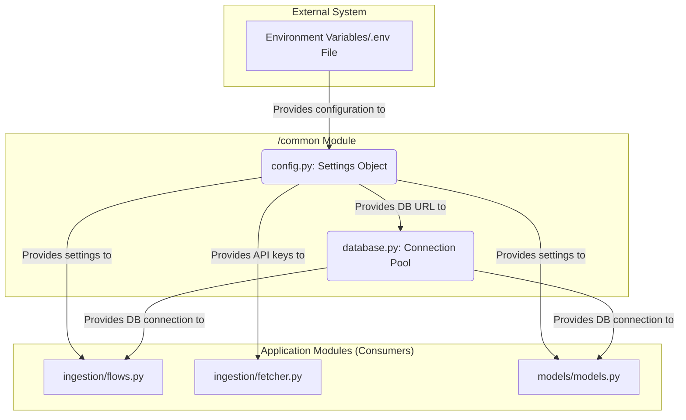
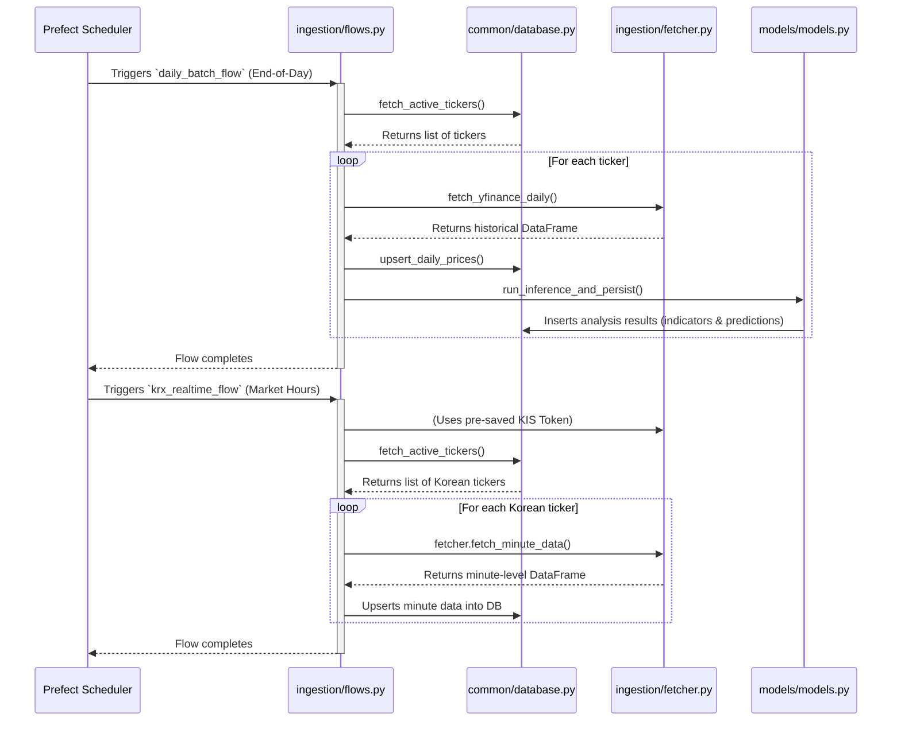
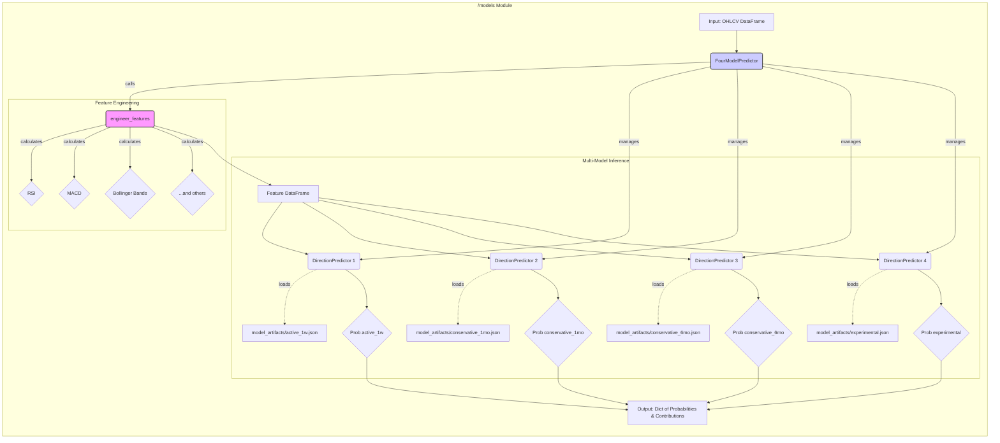

# Architecture Overview

This document provides a high-level overview of the `momentum-analysis-ingestion` service architecture.

## System Components & Deployment

The service is composed of three main components, all running as Docker containers managed by Docker Compose:

1.  **Prefect Server:** The central hub for orchestrating and monitoring the data ingestion pipelines. It provides a UI for observing flow runs and their states.

2.  **Prefect Worker:** This component is responsible for executing the data ingestion flows. It polls the Prefect server for new flow runs and, upon receiving a work order, it spins up a new Docker container to execute the flow.

3.  **PostgreSQL Database:** A PostgreSQL database is used to store all the financial data ingested by the Prefect flows.

### Deployment Diagram

The following diagram illustrates the interaction between the different runtime components of the system:

## Code-Level Architecture

This section details the internal structure and responsibilities of the Python modules.

### Module: /common

The `common` module provides foundational, cross-cutting services required by other parts of the application.

#### **Responsibilities & Logic Flow**

*   **Responsibility**: It is responsible for loading, validating, and providing access to all external configurations (e.g., credentials, hostnames, API keys) via a centralized `settings` object.
*   **Responsibility**: It manages the lifecycle of the PostgreSQL database connection pool, offering a simple, thread-safe interface for other modules to acquire and release connections.
*   **Input**: The module's primary input is the external environment (e.g., a `.env` file or shell environment variables) which provides the raw configuration values.
*   **Output**: Its primary outputs are a validated `settings` object from `config.py` and usable database connections from the managed pool in `database.py`.

#### **Component Diagram**

This diagram illustrates how the `common` module interacts with the environment and serves other application modules.

### Module: /ingestion

The `/ingestion` module is the system's core orchestration layer, built around Prefect flows. It handles all data fetching, processing, and storage logic.

#### **Responsibilities & Logic Flow**

*   **Responsibility**: Manages scheduled and ad-hoc data acquisition from multiple external financial APIs (`yfinance` for daily data, KIS for real-time Korean market data).
*   **Responsibility**: Orchestrates the persistence of raw and processed data by interfacing with the `common/database` module to write price history, technical indicators, and model predictions to PostgreSQL.
*   **Responsibility**: Triggers analysis and machine learning inference by invoking functions in the `/models` module with the newly fetched historical data.
*   **Input**: The primary inputs are the active ticker symbols queried from the database and API credentials provided by the `common/config` module.
*   **Output**: The module does not return values directly but writes extensively to the PostgreSQL database, populating the `price_daily`, `price_minute_ohlcv_kr`, and `analysis_info` tables.

#### **Workflow Diagram**

This sequence diagram illustrates the primary workflows orchestrated by the `ingestion/flows.py` file.

### Module: /models

The `/models` module is responsible for running machine learning inference to predict future market direction based on pre-calculated features. It encapsulates feature engineering and model prediction into a unified workflow.

#### **Responsibilities & Logic Flow**

*   **Responsibility**: The module's core responsibility is to transform raw OHLCV (Open, High, Low, Close, Volume) data into a set of engineered features and then use those features to generate predictions from a portfolio of four pre-trained XGBoost models.
*   **Input**: The primary input is a pandas DataFrame containing daily OHLCV data, sorted chronologically. A minimum of ~30 rows is required to compute the feature look-back windows.
*   **Output**: The main output is a tuple containing two dictionaries:
    1.  `probabilities`: A dictionary mapping each of the four model names to its predicted probability of a positive return (e.g., `{"active_1w": 0.82, ...}`).
    2.  `contributions`: A dictionary mapping each model to its top-3 local feature contributions (TreeSHAP values), explaining which features most influenced the prediction.
*   **Dependencies**:
    *   **Internal**: It depends on the `common.config` module to locate the `model_artifacts/` directory.
    *   **External**: It relies on `pandas` for data manipulation, `numpy` for numerical operations, and `xgboost` for loading models and running inference.

#### **Component Diagram**

This diagram illustrates the internal logic of the module and its interaction with the feature engineering sub-module.

