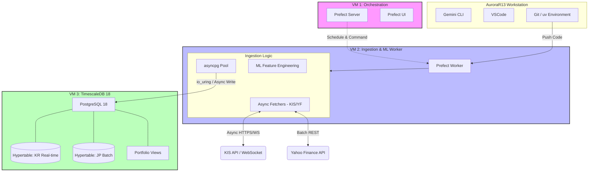

```mermaid
graph TD
    %% Dev Environment
    subgraph Workstation [AuroraR13 Workstation]
        CLI[Gemini CLI]
        VS[VSCode]
        Git[Git / uv Environment]
    end

    %% Control Plane
    subgraph ControlPlane [VM 1: Orchestration]
        PS[Prefect Server]
        UI[Prefect UI]
        %% Note: Default Worker Disabled
    end

    %% Data Plane
    subgraph DataPlane [VM 2: Ingestion & ML Worker]
        PW[Prefect Worker]
        subgraph Logic [Ingestion Logic]
            AF[Async Fetchers - KIS/YF]
            ML[ML Feature Engineering]
            APG[asyncpg Pool]
        end
    end

    %% Storage Layer
    subgraph Storage [VM 3: TimescaleDB 18]
        TS[PostgreSQL 18]
        H_KR[(Hypertable: KR Real-time)]
        H_JP[(Hypertable: JP Batch)]
        View[Portfolio Views]
    end

    %% External Sources
    API_KR(KIS API / WebSocket)
    API_JP(Yahoo Finance API)

    %% Connections
    Git -->|Push Code| PW
    PS -.->|Schedule & Command| PW
    PW --> Logic
    AF <-->|Async HTTPS/WS| API_KR
    AF <-->|Batch REST| API_JP
    ML --- Logic
    APG -->|io_uring / Async Write| TS
    TS --- H_KR
    TS --- H_JP
    TS --- View

    %% Formatting
    style ControlPlane fill:#f9f,stroke:#333,stroke-width:2px
    style DataPlane fill:#bbf,stroke:#333,stroke-width:2px
    style Storage fill:#bfb,stroke:#333,stroke-width:2px
```